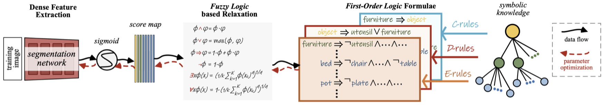

# LOGICSEG: Parsing Visual Semantics with Neural Logic Learning and Reasoning



This repo contains the pytorch version code and configuration files to reproduce [logicSeg](https://arxiv.org/abs/2203.14335). It is based on [mmsegmentaion](https://github.com/open-mmlab/mmsegmentation).


## Usage

### Installation 

Please refer to [get_started.md](https://github.com/open-mmlab/mmsegmentation/blob/master/docs/en/get_started.md#installation) for installation and dataset preparation.

### Requirement

Pytorch >= 1.8.0 & torchvision >= 0.9.0

### Inference
```
# single-gpu testing
python tools/test.py <CONFIG_FILE> <SEG_CHECKPOINT_FILE> --eval mIoU

# multi-gpu testing
tools/dist_test.sh <CONFIG_FILE> <SEG_CHECKPOINT_FILE> <GPU_NUM> --eval mIoU

# multi-gpu, multi-scale testing
tools/dist_test.sh <CONFIG_FILE> <SEG_CHECKPOINT_FILE> <GPU_NUM> --aug-test --eval mIoU
```

### Training

To train with pre-trained models, run:
```
# single-gpu training
python tools/train.py <CONFIG_FILE> --options model.pretrained=<PRETRAIN_MODEL> [model.backbone.use_checkpoint=True] [other optional arguments]

# multi-gpu training
tools/dist_train.sh <CONFIG_FILE> <GPU_NUM> --options model.pretrained=<PRETRAIN_MODEL> [model.backbone.use_checkpoint=True] [other optional arguments] 
```
For example, to train on Mapillary Vistas 2.0 with a `ResNet-101` backbone and 4 gpus, run:
```
tools/dist_train.sh local_configs/deeplabv3plus/deeplabv3plus_r101-d8_512x512_160k_mapillary_v2_hiera.py 4 
```

## Citing LogicSeg
```BibTeX
@inproceedings{li2023logicseg,
  title={Logicseg: Parsing visual semantics with neural logic learning and reasoning},
  author={Li, Liulei and Wang, Wenguan and Yang, Yi},
  booktitle=ICCV,
  year={2023}
}
```

Any comments, please email: liulei.li@student.uts.edu.au.